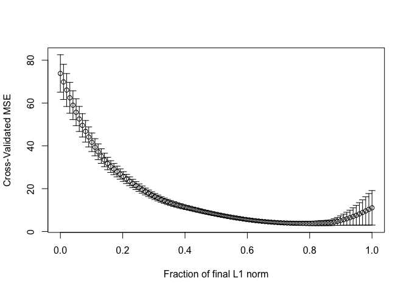

Regression Analysis
================

## Introductiion

This document contains steps to fitting linear regression. The data we
are using in this file is *fat* data from *Faraway* package. We are
going to split the data into two sets: A training set and test set. We
select every tenth observation as a test set and the rest as training
set. The goal of this is to select the best model that predicts body fat
percentage, *siri* given the test data.

These are models that we are going to include and compare:

-   Linear variable that includes all of the predictors.
-   Linear regression that selects predictors using AIC
-   Principal Component regression
-   Partial Least Squares
-   Ridge Regression

### Diving the data into two sets:

``` r
#loading the library and the data
library(faraway)
data(fat)

#divining the data
#Removing brozek and density
working_data = fat[ ,!(names(fat)%in%c("brozek","density"))]
#Test set
train_indices = seq(10, nrow(working_data), 10)
test_set = working_data[train_indices,]
# Training set
train_data = working_data[-train_indices,]
#taking a look at the first few data points
  # Test set
knitr::kable(head(test_set))
```

|     | siri | age | weight | height | adipos |  free | neck | chest | abdom |   hip | thigh | knee | ankle | biceps | forearm | wrist |
|:----|-----:|----:|-------:|-------:|-------:|------:|-----:|------:|------:|------:|------:|-----:|------:|-------:|--------:|------:|
| 10  | 11.7 |  23 | 198.25 |  73.50 |   25.8 | 174.4 | 42.1 |  99.6 |  88.6 | 104.1 |  63.1 | 41.7 |  25.0 |   35.6 |    30.0 |  19.2 |
| 20  | 16.5 |  33 | 211.75 |  73.50 |   27.6 | 176.8 | 40.0 | 106.2 | 100.5 | 109.0 |  65.8 | 40.6 |  24.0 |   37.1 |    30.1 |  18.2 |
| 30  |  8.8 |  29 | 160.75 |  69.00 |   23.8 | 145.7 | 36.7 |  97.4 |  83.5 |  98.7 |  58.9 | 35.3 |  22.6 |   30.1 |    26.7 |  17.6 |
| 40  | 32.6 |  50 | 203.00 |  67.00 |   31.8 | 139.4 | 40.2 | 114.8 | 108.1 | 102.5 |  61.3 | 41.1 |  24.7 |   34.1 |    31.0 |  18.3 |
| 50  |  4.0 |  47 | 127.50 |  66.75 |   20.2 | 121.2 | 34.0 |  83.4 |  70.4 |  87.2 |  50.6 | 34.4 |  21.9 |   26.8 |    25.8 |  16.8 |
| 60  | 24.6 |  61 | 179.75 |  65.75 |   29.2 | 136.7 | 38.4 | 104.8 |  98.3 |  99.6 |  60.6 | 37.7 |  22.9 |   34.5 |    29.6 |  18.5 |

``` r
  # Driving
knitr::kable(head(train_data))
```

| siri | age | weight | height | adipos |  free | neck | chest | abdom |   hip | thigh | knee | ankle | biceps | forearm | wrist |
|-----:|----:|-------:|-------:|-------:|------:|-----:|------:|------:|------:|------:|-----:|------:|-------:|--------:|------:|
| 12.3 |  23 | 154.25 |  67.75 |   23.7 | 134.9 | 36.2 |  93.1 |  85.2 |  94.5 |  59.0 | 37.3 |  21.9 |   32.0 |    27.4 |  17.1 |
|  6.1 |  22 | 173.25 |  72.25 |   23.4 | 161.3 | 38.5 |  93.6 |  83.0 |  98.7 |  58.7 | 37.3 |  23.4 |   30.5 |    28.9 |  18.2 |
| 25.3 |  22 | 154.00 |  66.25 |   24.7 | 116.0 | 34.0 |  95.8 |  87.9 |  99.2 |  59.6 | 38.9 |  24.0 |   28.8 |    25.2 |  16.6 |
| 10.4 |  26 | 184.75 |  72.25 |   24.9 | 164.7 | 37.4 | 101.8 |  86.4 | 101.2 |  60.1 | 37.3 |  22.8 |   32.4 |    29.4 |  18.2 |
| 28.7 |  24 | 184.25 |  71.25 |   25.6 | 133.1 | 34.4 |  97.3 | 100.0 | 101.9 |  63.2 | 42.2 |  24.0 |   32.2 |    27.7 |  17.7 |
| 20.9 |  24 | 210.25 |  74.75 |   26.5 | 167.0 | 39.0 | 104.5 |  94.4 | 107.8 |  66.0 | 42.0 |  25.6 |   35.7 |    30.6 |  18.8 |

## Fitting Linear regression with all of the predictors and running the predicitons

``` r
#fitting Linear regression and printing the output
(l_regression = lm(siri ~., train_data))
```

    ## 
    ## Call:
    ## lm(formula = siri ~ ., data = train_data)
    ## 
    ## Coefficients:
    ## (Intercept)          age       weight       height       adipos         free  
    ##  -12.591885     0.007978     0.362999     0.049026    -0.514032    -0.564773  
    ##        neck        chest        abdom          hip        thigh         knee  
    ##    0.016525     0.120219     0.140108     0.006197     0.195057     0.106637  
    ##       ankle       biceps      forearm        wrist  
    ##    0.125118     0.096199     0.230775     0.139279

``` r
#predicted set
predict_lr = predict(l_regression, test_set)
```

## Fitting Model with predictors selected by AIC

``` r
#model selected using AIC
(l_regAIC = step(l_regression, trace = 0))
```

    ## 
    ## Call:
    ## lm(formula = siri ~ weight + adipos + free + chest + abdom + 
    ##     thigh + knee + ankle + biceps + forearm, data = train_data)
    ## 
    ## Coefficients:
    ## (Intercept)       weight       adipos         free        chest        abdom  
    ##     -7.2477       0.3697      -0.5702      -0.5596       0.1210       0.1582  
    ##       thigh         knee        ankle       biceps      forearm  
    ##      0.1614       0.1277       0.1382       0.1122       0.2428

``` r
predict_AIC = predict(l_regAIC, test_set)
```

## Fitting Pricipal Component Regression

``` r
#loading the required library
library(pls)
```

``` r
fit_pcr = pcr(siri~ ., data = train_data, validation = "CV", 
              ncomp = (length(train_data) - 1))
# choosing the number of component
(comp = RMSEP(fit_pcr, estimate = "CV"))
```

    ## (Intercept)      1 comps      2 comps      3 comps      4 comps      5 comps  
    ##       8.551        7.227        5.002        2.170        1.839        1.848  
    ##     6 comps      7 comps      8 comps      9 comps     10 comps     11 comps  
    ##       1.773        1.750        1.862        1.914        1.911        1.933  
    ##    12 comps     13 comps     14 comps     15 comps  
    ##       1.934        1.969        1.941        4.244

``` r
# Predicting 
predict_pcr = predict(fit_pcr, ncomp = 5, test_set)
```

## Fitting Partial Least Squares Regression

``` r
fit_plsr = plsr(siri ~ ., data = train_data, ncomp = (length(train_data) - 1),
                validation = "CV")
# choosing the number of component
(comp = RMSEP(fit_plsr, estimate = "CV"))
```

    ## (Intercept)      1 comps      2 comps      3 comps      4 comps      5 comps  
    ##       8.551        6.413        3.064        2.080        1.831        1.965  
    ##     6 comps      7 comps      8 comps      9 comps     10 comps     11 comps  
    ##       2.023        2.086        2.220        2.507        3.254        3.411  
    ##    12 comps     13 comps     14 comps     15 comps  
    ##       3.422        3.439        3.446        3.446

``` r
#predicting
pred_Plsr = predict(fit_plsr, ncomp = 4, test_set)
```

## Fitting Ridge Regression

``` r
#loading the required library
library(MASS)
```

``` r
fit_ridge = lm.ridge(siri ~., data = train_data, lambda = seq(0, 1, len = 1000))
pred_ridge = cbind(1, as.matrix(test_set[, -1]))%*%coef(fit_ridge)[which.min(fit_ridge$GCV), ]
```

## Fitting Lasso Regression

``` r
#loading the required library
library(lars)
```

    ## Loaded lars 1.2

``` r
fit_lars = lars(as.matrix(train_data[, -1]), train_data$siri)
cvlmod = cv.lars(as.matrix(train_data[, -1]), train_data$siri)
```

<!-- -->

``` r
cvlmod$index[which.min(cvlmod$cv)]
```

    ## [1] 0.7878788

``` r
#predicting
pred_lars = predict(fit_lars, s = 0.7979798, as.matrix(test_set[, -1]), mode = "fraction")
```

## Taking a look at the performance of of the models

``` r
#RMSE function to compare models.
rmse = function(x, y) sqrt(mean((x-y)^2))
Comparison = data.frame(RMSE = c(rmse(predict_lr, test_set$siri),
                   rmse(predict_AIC, test_set$siri),
                   rmse(predict_pcr, test_set$siri),
                   rmse(pred_Plsr, test_set$siri),
                   rmse(pred_ridge, test_set$siri),
                   rmse(pred_lars$fit, test_set$siri)))
rows = c("Linear Regression",
         "AIC Variable selection",
         "PCA Variable selection",
         "PLS Variable Selection",
         "Ridge Regression",
         "Lasso Regression")
rownames(Comparison) = rows
knitr::kable(Comparison)
```

|                        |     RMSE |
|:-----------------------|---------:|
| Linear Regression      | 1.131529 |
| AIC Variable selection | 1.122020 |
| PCA Variable selection | 1.300218 |
| PLS Variable Selection | 1.124490 |
| Ridge Regression       | 1.128064 |
| Lasso Regression       | 1.093538 |

The above table summarises the performance of each model. We can see
that the model with the smallest RMSE is **AIC Variable Selection** model.
This means, it has the best generalized Performance. Whereas the **PCA
Variable Selection** has the largest RMSE which means it has the worst
performance in predicting the body fat percentage, *siri*.
